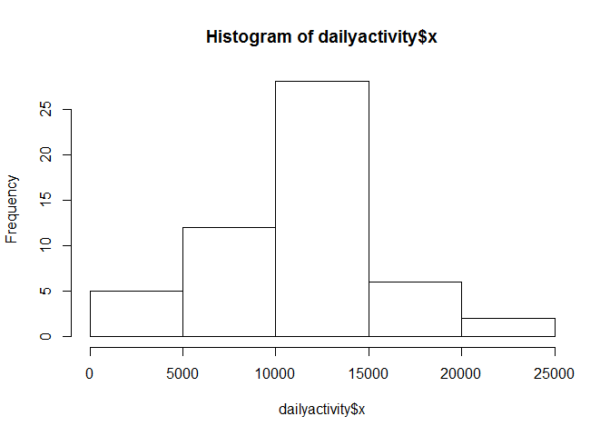
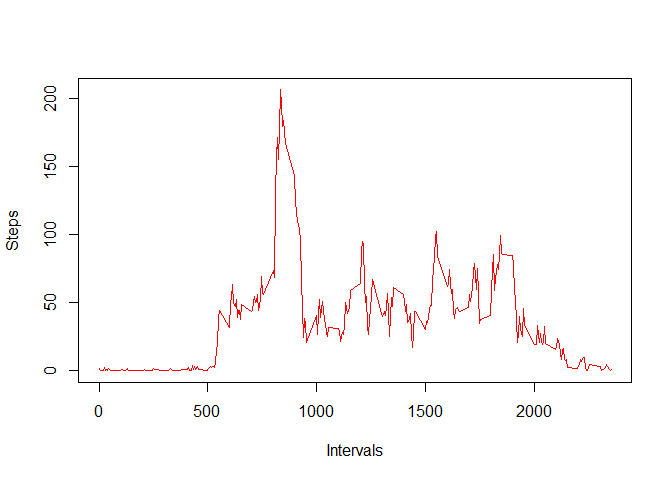
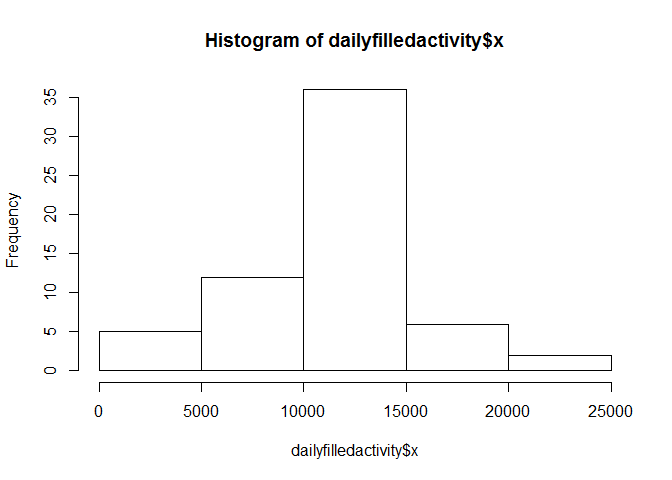
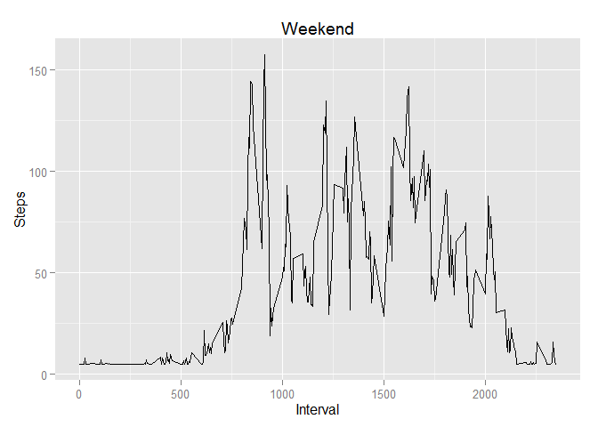
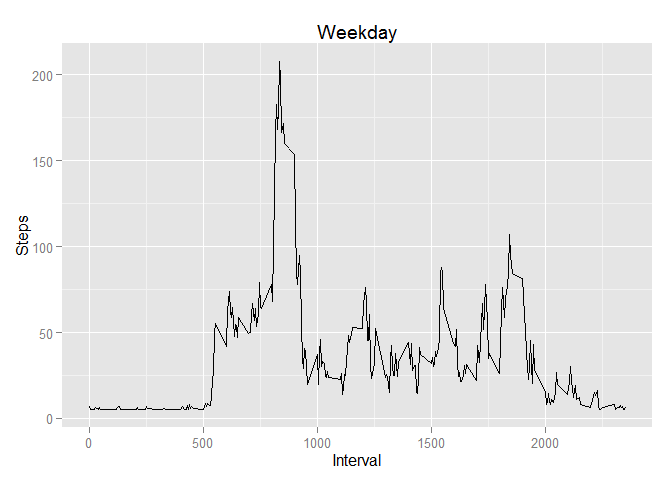

# Reproducible Research: Peer Assessment 1


## Loading and preprocessing the data

```r
library(data.table)
```

```
## Warning: package 'data.table' was built under R version 3.0.3
```

```r
library(ggplot2)
```

```
## Warning: package 'ggplot2' was built under R version 3.0.3
```

```r
unzip("activity.zip")
activity <- read.csv("activity.csv")
activity$date<- as.Date(activity$date)
```


## What is mean total number of steps taken per day?

```r
dailyactivity <- aggregate(activity$steps,list(Date=activity$date),sum)
hist(dailyactivity$x)
```

 

```r
median(dailyactivity$x,na.rm=TRUE)
```

```
## [1] 10765
```

```r
mean(dailyactivity$x,na.rm=TRUE)
```

```
## [1] 10766.19
```

## What is the average daily activity pattern?

```r
intervalactivity <- aggregate(activity$steps,list(Interval=activity$interval),mean,na.rm=TRUE)
plot(intervalactivity$Interval, intervalactivity$x, xlab= "Intervals", ylab= "Steps", type='l', col='red')  
```

 

```r
intervalactivity[which.max(intervalactivity$x),]
```

```
##     Interval        x
## 104      835 206.1698
```


## Imputing missing values

Calculate the number of missing values


```r
x<- complete.cases(activity)
sum(!x)
```

```
## [1] 2304
```

To fill in the missing values in the data set, take the mean for all intervals and substitute the missing value with that value.


```r
fill <- mean(intervalactivity$x)
filledactivity <- activity
for (i in 1:length(x)){
  if (x[i]==FALSE) filledactivity$steps[i] = fill
  }
```

Make a histogram and report the median and mean


```r
dailyfilledactivity <- aggregate(filledactivity$steps,list(Date=filledactivity$date),sum)
hist(dailyfilledactivity$x)
```

 

```r
median(dailyfilledactivity$x)
```

```
## [1] 10766.19
```

```r
mean(dailyfilledactivity$x)
```

```
## [1] 10766.19
```

## Are there differences in activity patterns between weekdays and weekends?

```r
filledactivity$dayofweek <- weekdays(filledactivity$date)

for (i in 1:length(filledactivity$date)){
     if (filledactivity$dayofweek[i] == 'Sunday' ){filledactivity$weekdayorend[i] =  "Weekend" } 
     else if (filledactivity$dayofweek[i] == 'Saturday' ){filledactivity$weekdayorend[i] = "Weekend"}
     else {filledactivity$weekdayorend[i] = "Weekday"}
}
weekday <- filledactivity[which(filledactivity$weekdayorend =='Weekday'),]
weekend <- filledactivity[which(filledactivity$weekdayorend =='Weekend'),]
weekdayagg <- aggregate(weekday$steps,list(Interval=weekday$interval),mean)
weekendagg <- aggregate(weekend$steps,list(Interval=weekend$interval),mean)


ggplot(weekendagg,aes(Interval,x)) + geom_line()+ggtitle('Weekend')+ylab("Steps")
```

 

```r
ggplot(weekdayagg,aes(Interval,x)) + geom_line()+ggtitle('Weekday')+ylab("Steps")
```

 
